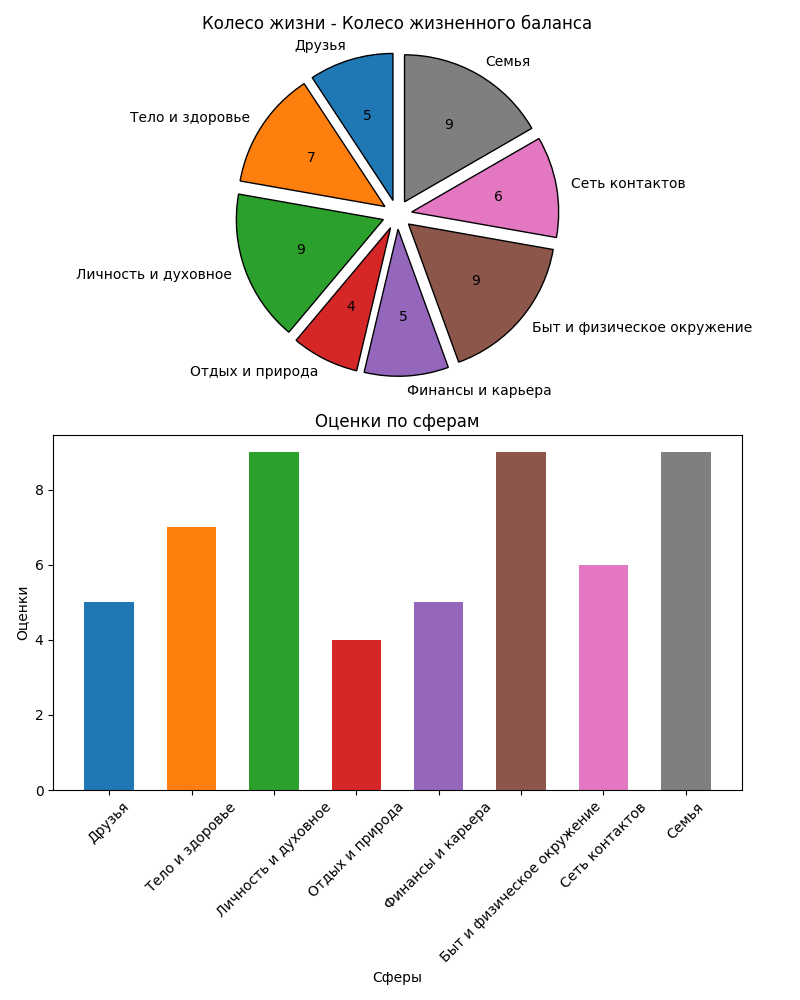

# Колесо жизни



Колесо жизни - это программа на языке Python, которая позволяет оценить и визуализировать баланс вашей жизни в различных сферах.

## Описание

Программа запрашивает у вас оценку удовлетворенности по шкале от 1 до 10 в различных сферах жизни. Затем она создает диаграмму колеса жизни и гистограмму, отображающие эти оценки. Диаграмма колеса жизни предоставляет визуальное представление баланса вашей жизни, а гистограмма показывает числовые оценки для каждой сферы.

## Предварительные требования

- Python 3
- Matplotlib
- NumPy

## Использование

1. Клонируйте репозиторий:
```
git clone https://github.com/oktober13/life_wheel.git
```
2. Перейдите в директорию проекта:
```
cd life_wheel
```
3. Установите зависимости, указанные в файле requirements.txt:
```
pip install -r requirements.txt
```
3. Запустите скрипт `main.py`:
```
python main.py
```
4. Следуйте инструкциям, чтобы ввести оценки для каждой сферы.

5. После ввода оценок для всех сфер, программа сгенерирует диаграмму колеса жизни и сохранит ее в файле `life_wheel.png` в текущей директории.

6. Вы можете просмотреть сгенерированную диаграмму и гистограмму в сохраненном файле `life_wheel.png`.

## Лицензия

Этот проект не требует лицензии, делайте с ним что хотите!